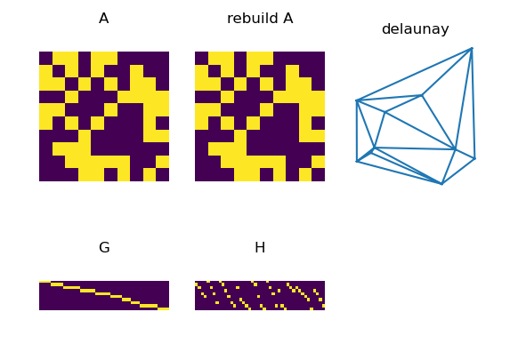
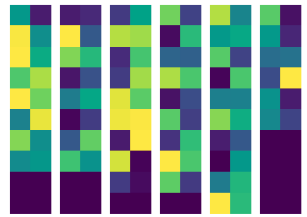
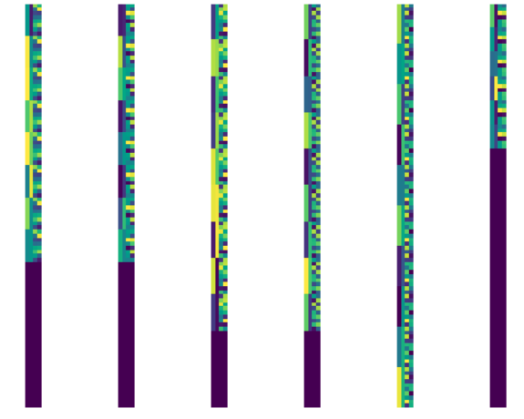

# Learning Combinatorial Solver for Graph Matching


2020 CVPR


## assign graph

在生成分配图assignment graph 时,输入的是一个btach的Tensor,如何对进行并行操作?


在`dataloader`中`__get_item__`获得

有没有方法使用矩阵的乘法获得?


$$
G^A_{ij} = G^1_{ij} * G^2_{ab}
$$

For edge generation of $G^A$ , we build an edge between a pair of nodes $v_{ia}^A, v_jb^A$,

nodes $v_{ia}, v_{jb}∈ V^A $if and only if there are two edges $(v i , v j ) ∈ E (1) $and$ (v_a , v_b ) \in E^(2)$ .


对于图邻域矩阵A的分解得到$G,H \in R ^{N_v \times N_e}$ , 其中$N_v$为节点的数量. $N_e$为边的数量. 重构A为$A = GH^T$




#### GMN的`reshape_dege_feature()`函数输入参数

~~最后一个维度的数据是一样的,都是egde_num,~~


将输入的F特征映射为边特征(线性映射,不参与学习)


```

F.shape = (batch_num, feat_num, node_num)

G,H.shape = (batch_num. node_num, edge_num)

X.shape = (batch_num, 2*feat_num, edge_num)

X[:, 0:feat_dim, :] = torch.matmul(F, G) 

X[:, feat_dim:2*feat_dim, :] = torch.matmul(F, H)
```


要考虑batch里面每一个样本点数的不同，会有不充满整个矩阵的情况。

## 结果记录








## 报错处理:

**RuntimeError: cuDNN error: CUDNN_STATUS_NOT_SUPPORTED. This error may appear if you passed in a non-contiguous input**


关闭cudann加速：torch.backends.cudnn.enabled = False

解决方案：把batchnorm改为instanceNorm

```python
layers.append(nn.BatchNorm2d(channels[i]))
layers.append(nn.InstanceNorm2d(channels[i]))
```


## 实现记录

--epoch 0-29 --batch 15 --iteration 200

Matching accuracy
aeroplane = 0.1754
bicycle = 0.3139
bird = 0.3053
boat = 0.3842
bottle = 0.6212
bus = 0.5521
car = 0.4973
cat = 0.2662
chair = 0.3352
cow = 0.2515
diningtable = 0.6909
dog = 0.2497
horse = 0.2549
motorbike = 0.3172
person = 0.2453
pottedplant = 0.6302
sheep = 0.3369
sofa = 0.3673
train = 0.7308
tvmonitor = 0.5909
average = 0.4058
Epoch 21/39