# Learning Combinatorial Solver for Graph Matching


2020 CVPR


## assign graph

在生成分配图assignment graph 时,输入的是一个btach的Tensor,如何对进行并行操作?


在`dataloader`中`__get_item__`获得

有没有方法使用矩阵的乘法获得?
$a=f$


$$
G^A_{ij} = G^1_{ij} * G^2_{ab}
$$

For edge generation of $G^A$ , we build an edge between a pair of nodes $v_{ia}^A, v_jb^A$,

nodes $v_{ia}, v_{jb}∈ V^A $if and only if there are two edges $(v i , v j ) ∈ E (1) $and$ (v_a , v_b ) \in E^(2)$ .


对于图邻域矩阵A的分解得到$G,H \in R ^{N_v \times N_e}$ , 其中$N_v$为节点的数量. $N_e$为边的数量. 重构A为$A = GH^T$


#### GMN的`reshape_dege_feature()`函数输入参数

~~最后一个维度的数据是一样的,都是egde_num,~~


将输入的F特征映射为边特征(线性映射,不参与学习)


```

F.shape = (batch_num, feat_num, node_num)

G,H.shape = (batch_num. node_num, edge_num)

X.shape = (batch_num, 2*feat_num, edge_num)

X[:, 0:feat_dim, :] = torch.matmul(F, G) 

X[:, feat_dim:2*feat_dim, :] = torch.matmul(F, H)
```


要考虑batch里面每一个样本点数的不同，会有不充满整个矩阵的情况。

## 结果记录


## 报错处理:

**RuntimeError: cuDNN error: CUDNN_STATUS_NOT_SUPPORTED. This error may appear if you passed in a non-contiguous input**


关闭cudann加速：torch.backends.cudnn.enabled = False

解决方案：把batchnorm改为instanceNorm

```python
layers.append(nn.BatchNorm2d(channels[i]))
layers.append(nn.InstanceNorm2d(channels[i]))
```

在github上找到一模一样的情况，给出的解决方案是减少batchsize。但是我的batchsize是8也会报错。。（Pytorch 1.4 cuda-toolkit 10.1 ubuntu 16.0.4.环境）

https://github.com/pytorch/pytorch/issues/32564

## 实现记录

--epoch 0-29 --batch 15 --iteration 200

**epoch21**
aeroplane = 0.1754
bicycle = 0.3139
bird = 0.3053
boat = 0.3842
bottle = 0.6212
bus = 0.5521
car = 0.4973
cat = 0.2662
chair = 0.3352
cow = 0.2515
diningtable = 0.6909
dog = 0.2497
horse = 0.2549
motorbike = 0.3172
person = 0.2453
pottedplant = 0.6302
sheep = 0.3369
sofa = 0.3673
train = 0.7308
tvmonitor = 0.5909
average = 0.4058
Epoch 21/39

**Epoch29**
Evaluation complete in 2m 44s
Matching accuracy
aeroplane = 0.1844
bicycle = 0.3368
bird = 0.3053
boat = 0.4455
bottle = 0.7079
bus = 0.6333
car = 0.5508
cat = 0.3054
chair = 0.3520
cow = 0.2688
diningtable = 0.7660
dog = 0.3031
horse = 0.3302
motorbike = 0.3570
person = 0.3142
pottedplant = 0.7623
sheep = 0.3795
sofa = 0.3948
train = 0.6805
tvmonitor = 0.8409
average = 0.4609
Epoch 29/39


**Epoch38**

```
Evaluation complete in 2m 41s
Matching accuracy
aeroplane = 0.2022
bicycle = 0.3722
bird = 0.3215
boat = 0.4851
bottle = 0.7347
bus = 0.7000
car = 0.6132
cat = 0.3042
chair = 0.3450
cow = 0.2992
diningtable = 0.8631
dog = 0.3168
horse = 0.3622
motorbike = 0.3997
person = 0.3659
pottedplant = 0.8226
sheep = 0.3768
sofa = 0.4304
train = 0.7633
tvmonitor = 0.8864
average = 0.4982
Epoch 38/39
```

结论:精度很低

分析原因:

输出的变量没有约束好,Loss设计有问题. 

后来检查的原因：

分配图graph_assign的生成有问题，需要每一个样本都处理。

梯度没有回传

### stride检查

```python


A_src #shape=(15,15,15) stride=(225, 15, 1)

A_tgt  #shape =(15,15,15) stride=(225, 15, 1)

A_ass.stride() #shape=(15,225,225),stride=(50625, 50625,225, 1)

node_src#shape=(15,15,2), stride=(30,2,1)

node_tgt#shape=(15,15,2), stride=(30,2,1)
edge_src#shape=(15,15,15,4),stride=(900, 60, 4, 1)

node_ass #shape=(15, 4, 225), stride=(900 ,1, 4)
edge-ass #shape=(15, 8, 225, 225),stride=( 405000,1,1800,8)
edge_feat #(3240000, 50625, 225, 1)

```

\

修改MLP的nn.conv1d结构为nn.Linear.

变化：没有了instanceNorm，没有激活函数，通道由bchw变为bhwc。

原本的channelds_last属性只能使用在4D张量上。


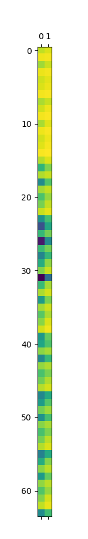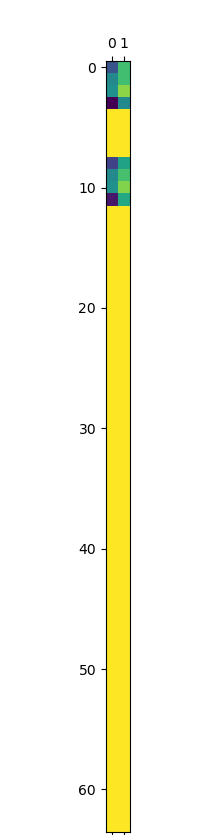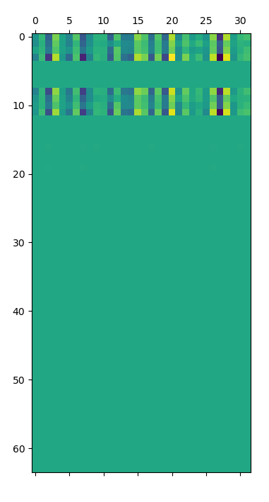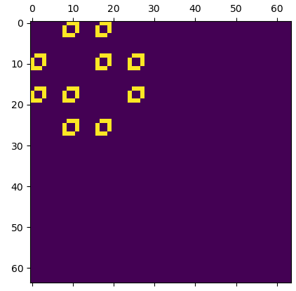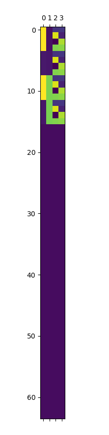

node_feat0，node_feat1，node_feat2

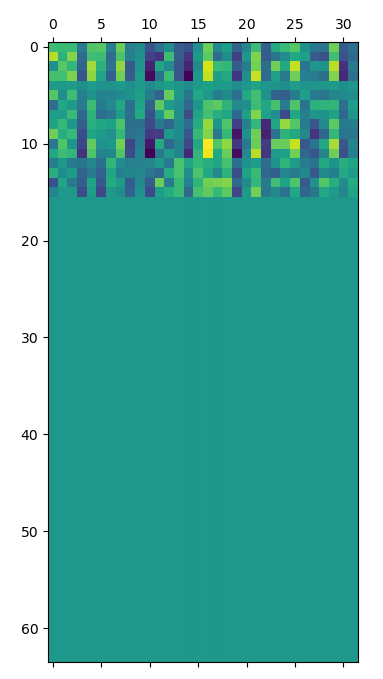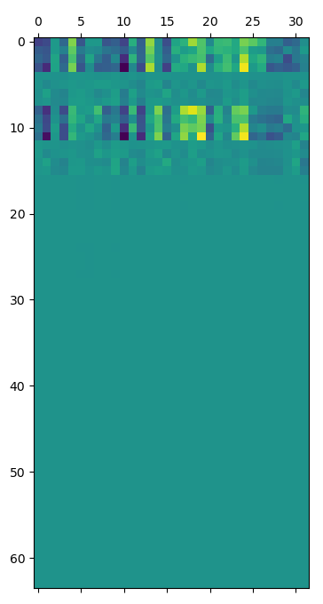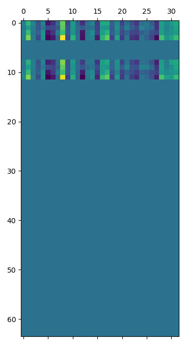

没有进行归一化，归一化后的node_feat1,node_feat2,node_feat3, node_out

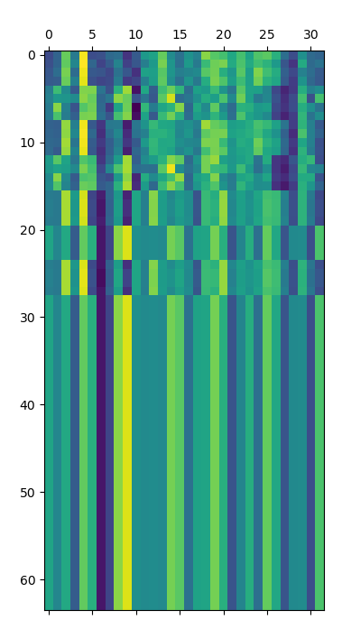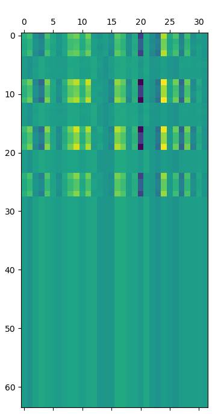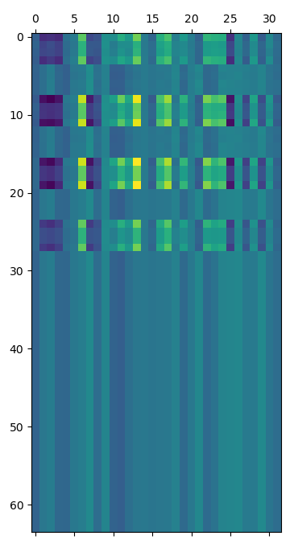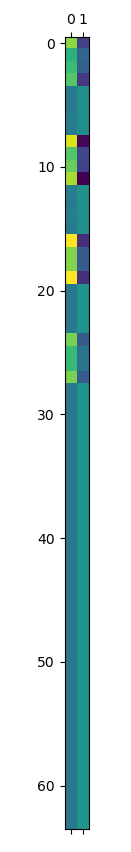

发现是graph_ass的生成没有每一个样本进行处理，处理后结果如下：

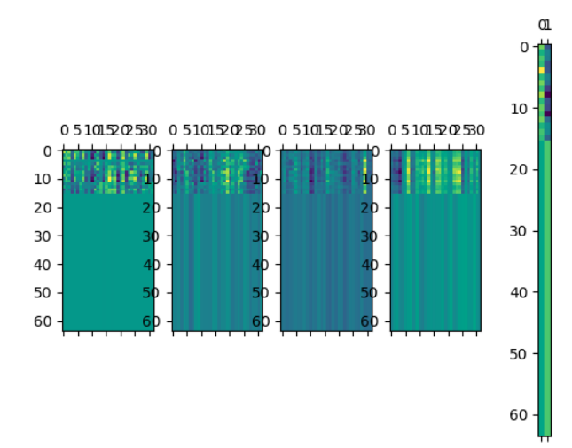

考虑loss的设计，lcsgm里面的constraint loss用了直接求和，可能会令正负数相抵消，导致loss不可导？感觉实际上并没有做到归一化约束的效果。（这个要设计实验）


指标：200iteration后精度至少要达到45以上


指标：1200iteration精度为31

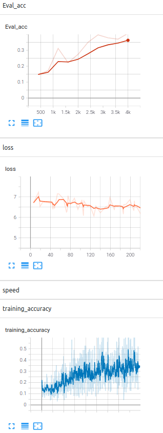

精度难以下降，考虑是Loss用了argmax，没办法反传参数。


修改Loss后的结果：400iteration精度为45，

```
Evaluation complete in 1m 17s
Matching accuracy
aeroplane = 0.2355
bicycle = 0.3996
bird = 0.4100
boat = 0.5709
bottle = 0.8252
bus = 0.8403
car = 0.6323
cat = 0.4611
chair = 0.3994
cow = 0.3886
diningtable = 0.9569
dog = 0.3964
horse = 0.4871
motorbike = 0.3518
person = 0.4035
pottedplant = 0.9630
sheep = 0.4522
sofa = 0.4771
train = 0.8864
tvmonitor = 0.9036
average = 0.5720
Training complete in 3h 25m 22s
```


增加全局约束后的实验：4-23-13-34


# 通过源代码进行复现

- 加入了layerorm
- 在节点特征(4维)上加入(2维)的idx特征.
- 特征是否需要归一化?
- MLP为[input, 16, 16], 中间有一层隐藏层
- 加入一个1维的global特征(?)`self.graph["features"] `is a tensor of shape `global_shape`,or `None`.
- 使用group记录匹配数, group.shape=(ns, 1)
- 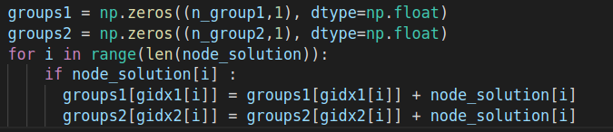

## 变量内容记录

**input_graph(输入图)**

​	gidx1/2: 单个图的节点索引, `shape=(ns, 1)/(nt, 1)`

​	groups1/2: 判断是否匹配的节点数量`shape=zeros(ns*nt, 1)`

​	node_features: 节点特征(后面增加两维度索引): `shape=(ns*nt, [xs,ys,xt,yt,idxs,idxt])`

**target_graph(输出图)**

​	gidx1/2: 单个图的节点索引, `shape=(n, 1)`

​	groups1/2: 判断是否匹配的节点数量`shape=ones(ns*nt, 1)`

​	node_features: 节点特征(后面增加两维度索引)`shape=(ns*nt, 1)`

使用sender和receiver发送和接受信息

```python
return {

        NODES: nodes,
        EDGES: edges,
        RECEIVERS: receivers,
        SENDERS: senders,
        GLOBALS: globals_,
        N_NODE: number_of_nodes,
        N_EDGE: number_of_edges,
        N_GROUP_1: number_of_groups_1,
        GROUP_INDICES_1: group_indices_1,
        GROUPS_1: groups_1,
        N_GROUP_2: number_of_groups_2,
   }
```


group