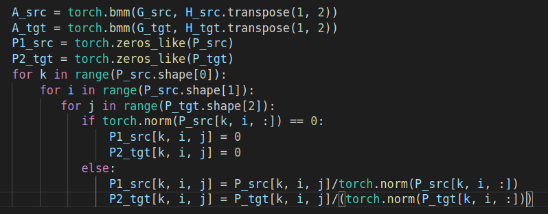
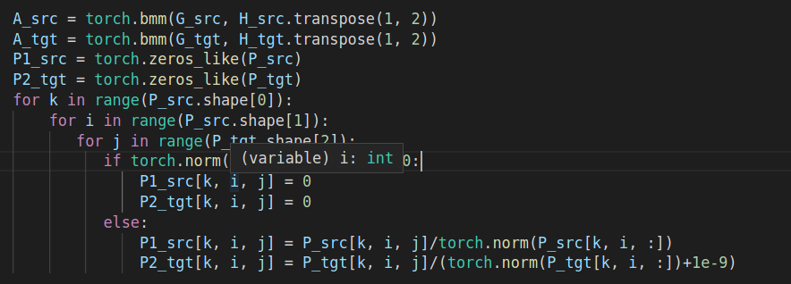
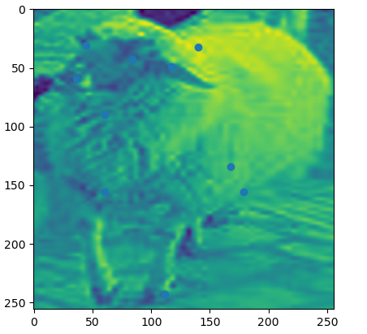
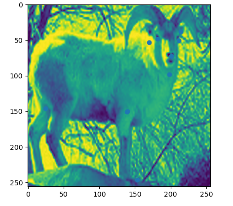

# 数据集的问题

在设计Loss的时候出现nan的情况，应该是出现了负数。

往前查看发现有一些关键点超出boundsbox的边界

然后记录这些情况，首先设计了将尽可能多的点包含进去。但是这是基于所有点都在图片上的假设，然而实际上就是有关键点坐标为负数以及超出了图像边界。

修改过后还是会出现nan的情况,便逐个代码debug,最后发现是model里面点的归一化没写好,

`P2_tgt`如果为0,则会出现0/0的情况,于是按照上面在后面加上eps, 然后代码就没有报错.

这个差异来的特别大,几乎无法在几何空间进行相似度匹配

