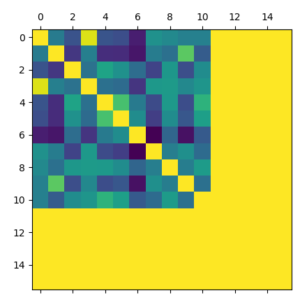
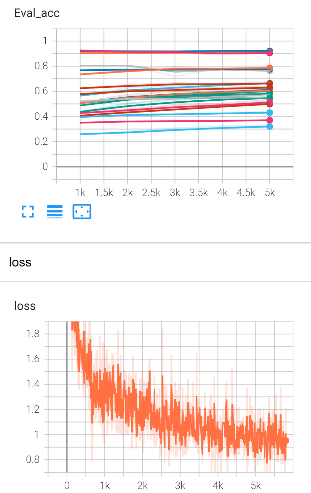

修改归一化

原文使用循环的方法

```python
P1_src = torch.zeros_like(P_src)
P2_tgt = torch.zeros_like(P_tgt)
	for k in range(P_src.shape[0]):
		for i in range(P_src.shape[1]):	
			for j in range(P_tgt.shape[2]):
				if torch.norm(P_src[k, i, :]) == 0:
					P1_src[k, i, j] = 0
					P2_tgt[k, i, j] = 0
				 else:
				 	P1_src[k, i, j] = P_src[k, i, j]/torch.norm(P_src[k, i, :])
				 	P2_tgt[k, i, j] = P_tgt[k, i, j]/torch.norm(P_tgt[k, i, :])     
```

改进

```python
P1_norm = torch.norm(P_src, dim=2)
P2_norm = torch.norm(P_src, dim=2)
P1_norm = torch.where(P1_norm==0, 1, P1_norm)
P2_norm = torch.where(P2_norm==0, 1, P2_norm)
P1_src = P_src / P1_norm[:,:,None]
P2_tgt = P_tgt / P2_norm[:,:,None]
```


速度下降很多

| name   | speed | loss-start | loss-static(epoch) |
| ------ | ----- | ---------- | ------------------ |
| PCA-GM | 10.5  | 2.90       | 0.65(6)            |
| LCSGM  | 13.5  | 1.18       | 0.63(4)            |
| QCDGM  | 1.99  | 2.43       |                    |

首先对QCDGM提速，但是有一段代码改不了，改变了会导致效果变差甚至loss发散。




AA_src可视化

