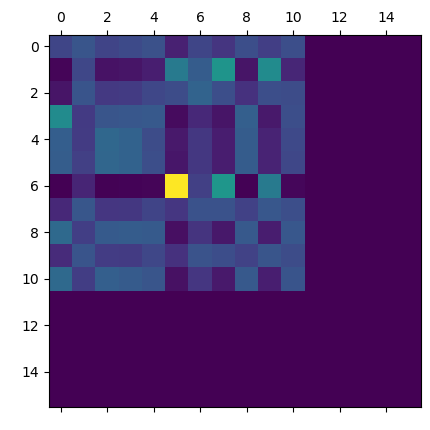
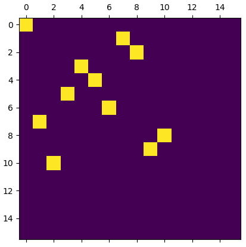
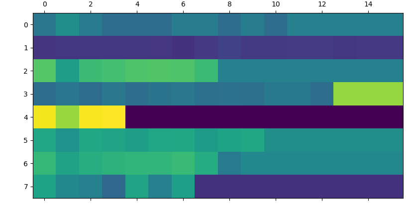
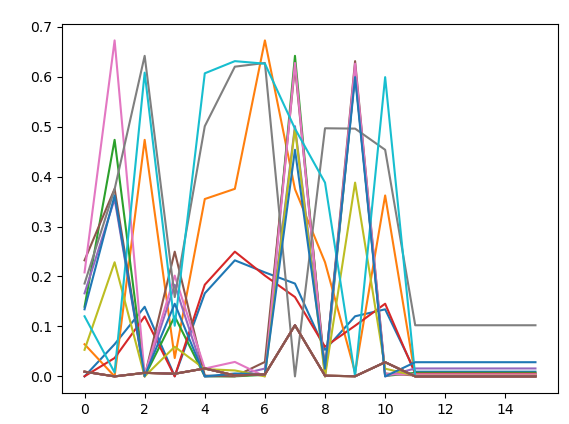

# 自监督图匹配

第一次网络输出的预测匹配矩阵P




损失的第一项的值, 纵轴(batch), 横轴(每一个点的距离值)



一开始,每一个图变换后的点距离各个点的误差值都很接近.

可视化结果:

源图的点分布

变换后的点分布

目标图的点分布


二阶误差项



二阶项的损失会导致梯度爆炸,无法继续训练

并不是梯度爆炸,而是使用了小于0的值开根号.

```
Function 'SqrtBackward' returned nan values in its 0th output.
```

