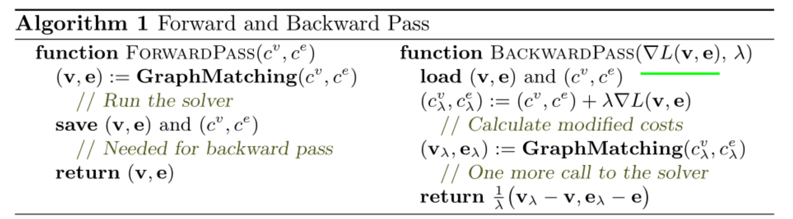
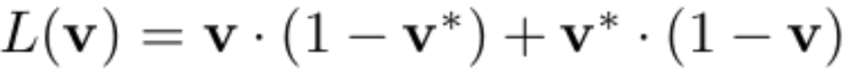
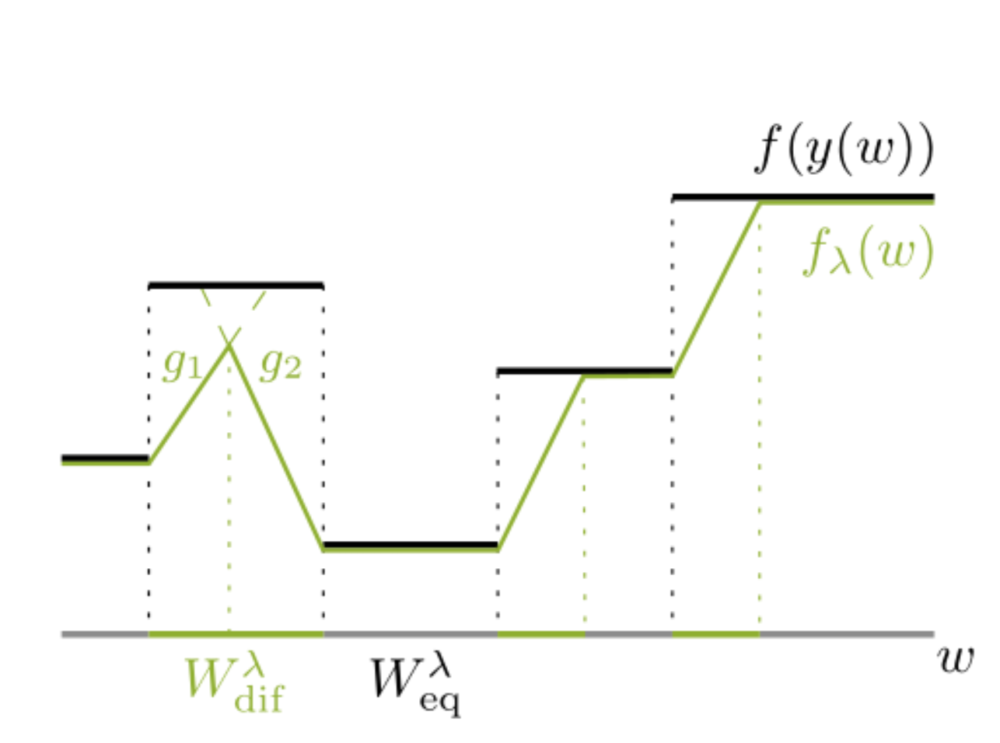
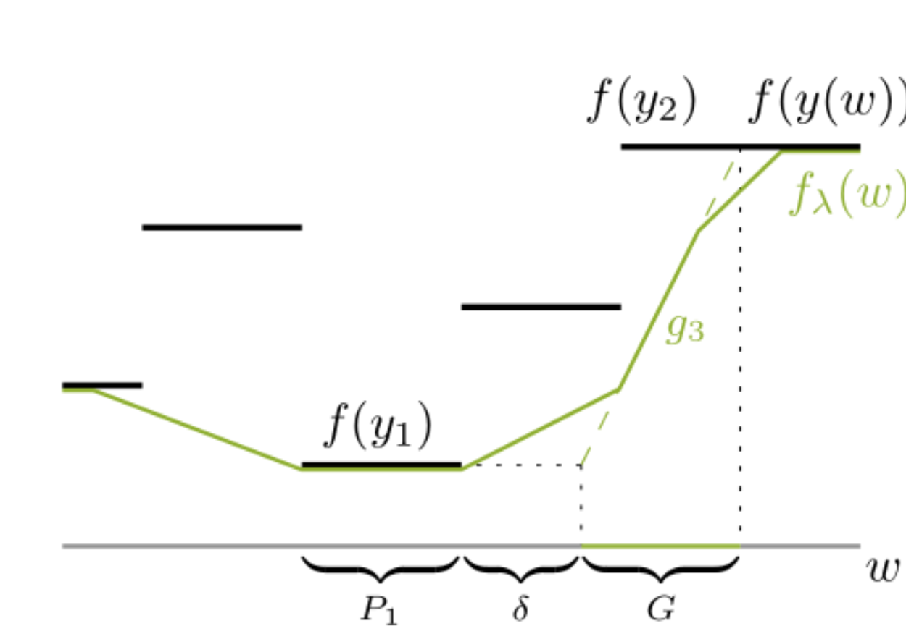

# Deep Graph Matching via Blackbox Differentiation of Combinatorial Solvers

## 主要创新

设计了可差分的优化器，结合拉格朗日对梯度进行一定的“软化”。

其实我觉得就是自定义了反传的过程。

## 主要思想

对于求解优化问题如下：
$$
arg \min_{\bf v} \bf c\cdot v
$$

对于给定的输入成本${\bf c} \in R^N$,输出符合任意约束的求解结果${\bf v}\in \{0,1\}^N$

该工作的思想是，使用黑盒子（任意求解器，不需要可微）求出$\bf v$， 设计了给定的反传参数规则可以让$\bf v$能够反传参数，作为$c$的梯度，同样可以达到微分的效果。

具体的算法如下所示：

设计的Loss为Hamming Distance，只要最后结果不正确是1，正确为0.

$$
\nabla L_v(v) = 1 - 2 \bf v^*
$$
该工作主要参考了论文[1]的设计，思想是插入任意的黑盒子组合求解器，不需要管里面的计算过程是如何的，只需要最后返回梯度即可。

返回梯度的方法是模仿了拉格朗日松弛，在前向和后向分别进行以此黑盒子计算，根据两次的差最终计算梯度。

## 在实现上

论文的工作其实是对参数进行了插值。

对于网络学习出来的表示$w$，如果直接使用求解器求解，得到的结果的梯度对于$w$是离散且无意义的常数平台。如下图所示，因为求解得到结果是离散的变量，会导致$w$的梯度是截断式的平台。

而论文中使用了两次的计算，对输出函数进行了插值，而且是保持了最低点的平台，

这样可以保证单网络接近groundtruth的时候，不会再对$w$进行较大的梯度下降，从而减少了常数过拟合的情况。

## 启发

我之前在使用Sinhorn的时候就想过设计一种方法，可以得到离散的结果$y\in \{0,1\}$，又能够反传梯度。我当时钻进去研究Hunagrian算法。

而这个论文的做法更加广泛，他不管用什么求解器，他根据拉格朗日松弛给了一个通用的梯度求解方法。

## 算法的不足

这个算法只能对输入输出size相同的情况进行计算，如果size不一样，就无法计算。所以实际上要达到较好效果，可能不一定是用黑盒子模型，还要考虑到里面的计算过程，或者做一些简化。

## 代码实现上的技巧

- 在加载数据集的时候，去除了超出边界的点，减少了噪声

- 虽然论文中使用了一阶节点和二阶节点的特征，但是在实际代码实现上，只是用了节点的特征。说明论文中的输入输出size相同的限制还是一样的，无法解除约束。
- 使用了torch_geomeric框架，并且在求解器上使用了c的实现，速度快了很多。

