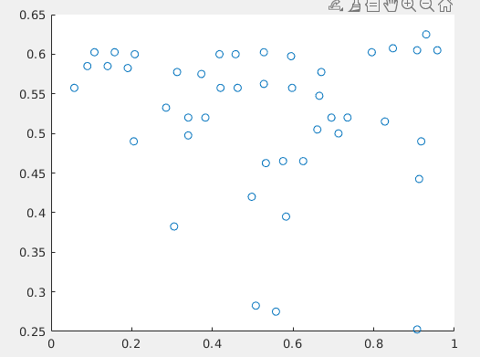
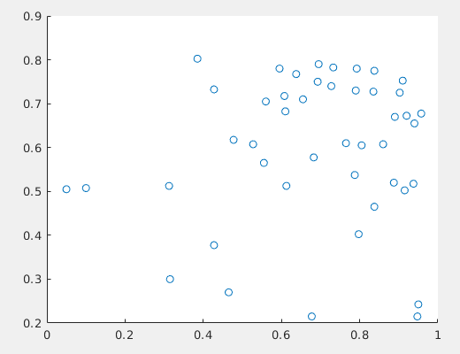

## 图映射到泛函空间

FUnctional Resresentation for Graph Matching

代码阅读:


输入

$X \in R^{n \times 2}$为n个源域的数据点

$Y \in R^{n \times 2}$为n个目标域的数据点




option:

```matlab
option.M_exist = 10;
option.alpha2 = 1;
option.maxiter = 100;
option.active = 1;
option.func = 'inner';
option.q_norm = 2;
option.type = 'inner';
option.full = 1;
option.rota = 0;
```


M_shape函数生成匹配矩阵,首先分别生成BH1,BH2,然后计算分布损失并归一化.

```
[M,~,~] = M_shape(XX,YY,1/8,2,option.rota);
[BH1] = sc_compute(X',zeros(1,LX),[],12,5,r0,r1,zeros(1,LX));%BH1(i,:)
[BH2] = sc_compute(Y',zeros(1,LY),[],12,5,r0,r1,zeros(1,LY));
MS = hist_cost_2(BH1,BH2);
MS = MS/max(MS(:));
```


sc_compute用于计算节点之间的距离,其中每一个节点的特征$BH_i$为如下表示:
$$
BH_{i} = [b_{i}]
$$
d = dist_log


GM_Gen通用图匹配输入

```matlab
FRGM_Gen(Map_init, M, WX, WY, SW, asgt, sig, weight)
%     Map_ini:initialization
%     M:unary term, dissimilarity between two graphs
%     WX,WY:pairwise edge attributes of two graphs
%     SX: weighted adjacency matrix of graph X
%     option: parameters
%     asgt: ground-truth
%     sig:sigma of X and Y
%     weight: weights of the unary and pairwise term for the second objective function
```


- 主要的迭代函数 GM_PathorDis(Map_ini,M0,DX,DY,SX,option)

要区分好几个M:

Map_ini:初始化的匹配矩阵(映射矩阵),是直接用M进行匈牙利算法得到的

{0,1}矩阵$P^*_0$,
$$ {2}
P^*_0{_{ij}} = 1 \to v_i 和v_j匹配 \\
P^*_0{_{ij}} = 0 \to v_i 和v_j不匹配
$$
M0:不相似度矩阵,数值越大,节点距离越远
$$
M_{ij} =||( v_i - v_j )||^2_2
$$
M:梯度矩阵,F为目标函数$F = (1-\alpha)<P,D>+\alpha(||E-F(P)||_F)$
$$
M_{ij} = \frac{dF}{P_{ij}}
$$
其中输入的P是一开始的Map_ini,也就是说用匈牙利算法得到初始的0-1矩阵作为迭代的初始变量


Map :每一次对M进行线性规划求解更新后的P


dmap:	初始化:Map和Map_ini的差

​				每一次更新Map之间的差

M1: 等价梯度M


迭代参数kp,

函数的整体框架:

初始自变量P = Map_ini

首先对目标函数F(P)在初始变量Map_ini处求梯度M

循环体1(cnt+=1):

​	kp = 0

​	对梯度M求0-1线性规划结果Map=LAPJV(M1), Ma

​	dMap = Map - Map_tmp dMap为在{0,1}分配结果和初始值之间的方向

.


​	

conditction1: 当前循环次数小于最小迭代次数

condictoin2:  当前循环次数小于最大迭代次数,kp小于ST,右边项大于1e-7


left:左边项 $\Delta f (x)* dx$

right:右边项 $F1-F2$

$F2 = P_{n-1} + 0.5^{n+1}*dP$


