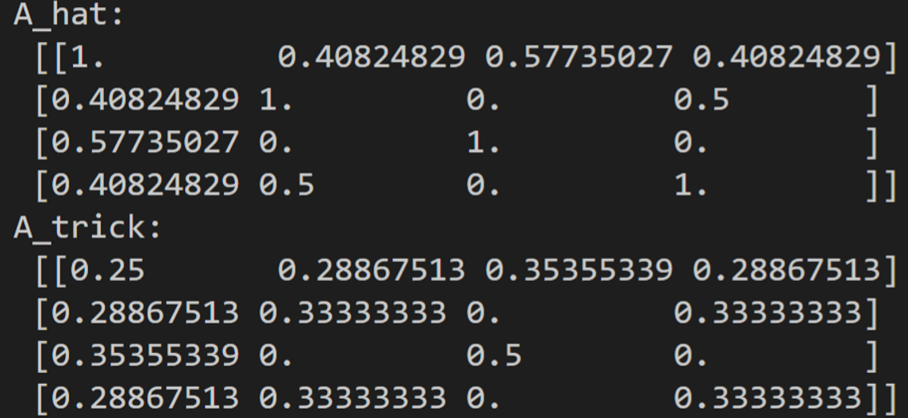
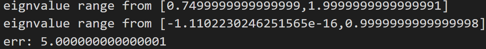
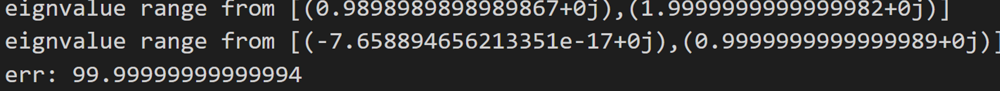

# GCN近似

两个结果的误差为矩阵n的大小

$$
\hat A = I_n + D^{-\frac{1}{2}}AD^{-\frac{1}{2}}\\
\tilde A = A + I_N\\
\tilde D = \sum_i A_{ij}\\
\tilde A' = \tilde D ^{-\frac{1}{2}}\tilde  A\tilde D^{-\frac{1}{2}}
$$
两种归一化方式，并不是恒等变换，由于$\hat A$的特征值在[0,2]之间，会导致经过反复卷积后产生震荡，而$\hat A'$的特征值在[0,1]之间，因此以上的误差就来源于特征值的差异。
$$
\begin{array}{rl}
\epsilon &= \sum_{ij} |\hat A_{ij}-\hat A'_{ij}|\\
		 &\approx E(\hat A) - E(\hat A')\\
		 &=\sqrt{ \sum_{ij}(1-0)}\\
		 &=n
\end{array}
$$

从下图可以看出两种归一化的求和误差接近矩阵的大小n，特征值分别是[0,2]和[0, 1]

矩阵尺寸为5x5

矩阵尺寸为100x100

