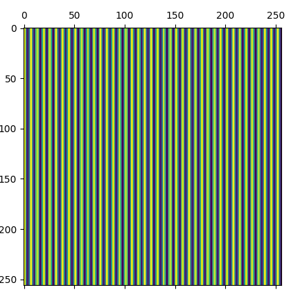
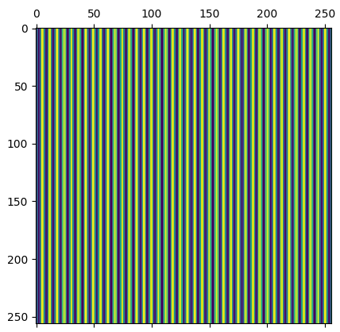
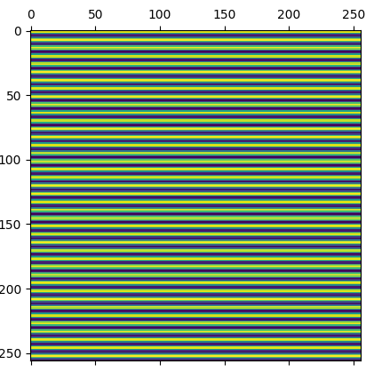
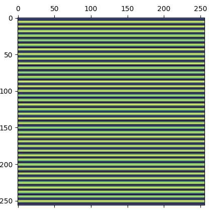
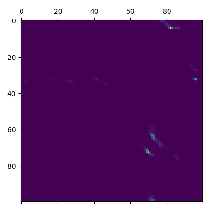
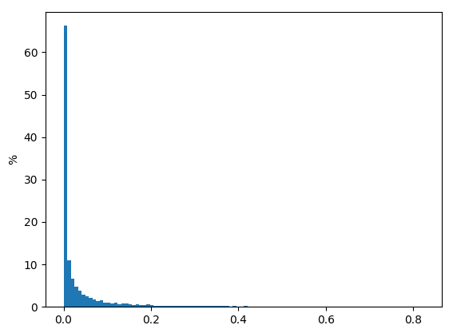
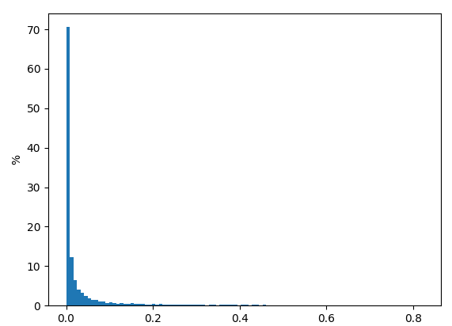
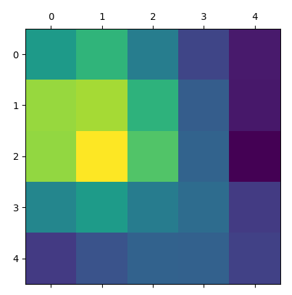

forward

1. Local Feartyure CNN

- backbone: ResNetFPN_8_2

```python
feats_c, feats_f = self.backbone(torch.cat([data['image0'], data['image1']], dim=0))
```

输入的图像尺寸: 840x840x1

输出feats_c 尺寸:  256x105x105 为1/8

输出feats_f 尺寸:  128x420x420 


2.  coarse-level loftr module

   

- 将二维的图像变成拉伸得到向量: 11025*256

```python
feat_c1 = rearrange(self.pos_encoding(feat_c1), 'n c h w -> n (h w) c') 
```

  

- 计算mask

- 输入到loftr_coarse(LocalFeatureTransformer)

  - 在layer层进行encoder(LoFTREncoderLayer)

  - encoder层是常用的transformer结构

```python
query, key, value = x, source, source

# multi-head attention
query = self.q_proj(query).view(bs, -1, self.nhead, self.dim)  # [N, L, (H, D)]
key = self.k_proj(key).view(bs, -1, self.nhead, self.dim)  # [N, S, (H, D)]
value = self.v_proj(value).view(bs, -1, self.nhead, self.dim)
message = self.attention(query, key, value, q_mask=x_mask, kv_mask=source_mask)  # [N, L, (H, D)]
message = self.merge(message.view(bs, -1, self.nhead*self.dim))  # [N, L, C]
message = self.norm1(message)

# feed-forward network
message = self.mlp(torch.cat([x, message], dim=2))
message = self.norm2(message)

return x + message
```

    	feat0 = layer(feat0, feat0, mask0, mask0)


positional




model config:


coarse:

- d_model: 256
- d_ffn: 256
- nhead: 8
- layer_name:\[scscscsc\](8) s代表self-attention  c代表cross-attention 一共8个
- attention: linear


fine:

- d_model: 128
- d_ffn: 128
- nhead: 8
- layer_name:\[sc\](2) s代表self-attention  c代表cross-attention 一共8个
- attention: linear


匹配矩阵的可视化



矩阵的列求和数值统计, 矩阵的行求和统计




- FineMatching:

  最后的确定匹配 输入的M WW C 这里M是什么,M是候选匹配对的数量.

  

feat0_picked 选择了中间的一个特征

feat_f0_picked = feat_f0[:, WW//2, :]

WW//2即中间特征的索引.


> 如果使用softamx 预先生成temp的分母,减少计算内存的消耗?

生成的heatmap的可视化



## 最后的总结


整体来说,LoFTR是一个两步式的Transformer结构网络,但是其只是用了self-attention模块,网络主要分为两个部分:粗匹配和精匹配阶段

粗匹配阶段使用attention进行encoding,并计算图之间所有向量的相似度,最后使用dual-softmax计算匹配结果,选出匹配矩阵$P_{ij}$中超出阈值的部分,得到对应的匹配点$\hat{i},\hat{j} $


精细匹配阶段对$\hat i, \hat j$为中心提取窗口w(w=5)大小的窗口,再次使用attention进行encoding,得到两个以$\hat i, \hat j$为中心的特征图,用$\hat i$对所有的j窗口的特征求相似度和softmax归一化,得到偏移向量$\tilde j$,最终的匹配点坐标为$j = \hat j + \tilde j$.

 


## 引用阅读

使用dual-softmax方法: 

Neighbourhood Consensus Networks

DISK: Learning local features with policy gradient

