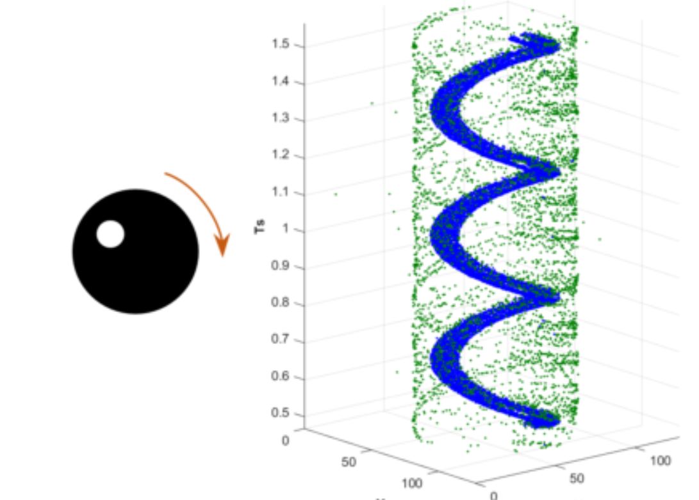

# Probabilistic Undirected Graph Based Denoising Method for Dynamic Vision Sensor

### 任务：

事件相机去噪声

### 使用方法：

概率图去噪声, 使用概率图(0-1)模型.

对事件流构成3维结构$v_i = (x_i,y_i, e_i)$,其中$e_i$为事件点的正负,对三维数据进行遍历.

## 模型等效考虑

将每一个时间点作为节点,如果节点与周围节点有连接,则认为周围的事件值一致,该点就不是噪声.

可以看成是对图像进行了平均,从而达到消除噪声的作用.

