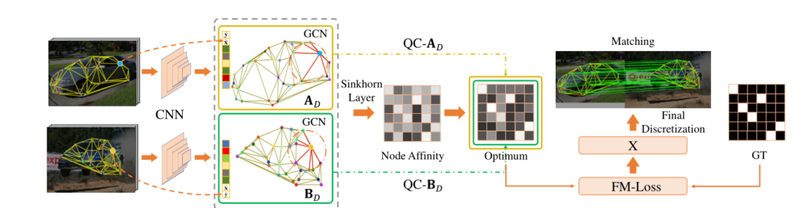
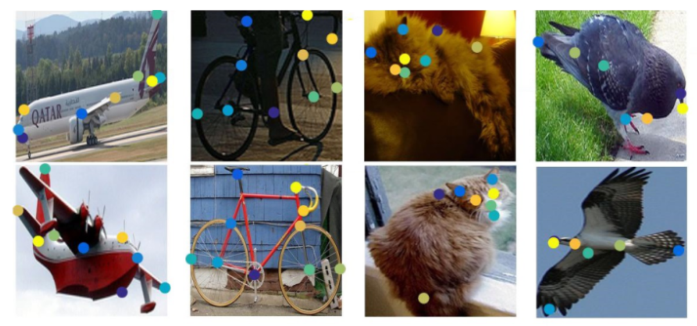

# [Paper Note]deep graph matching under quadratic constraint

2021CVPR

主要解决问题：

1. 一一对应的约束
2. 样本不平衡问题

解决方法

1. 双线性迭代
2. false matching loss

### 解决思路：

将节点特征embeding后，得到图结构$A,B$，将两个图结构进行比较。去除了节点之间的特征，将节点信息嵌入到图结构中。

**优点**：将关键点的信息转化为图的结构信息，在跨模态情况下，不需要考虑跨模态关键点信息的相似性，只需要考虑令同模态关键点之间学习到相似的连接关系。

**不足**：

### 可以做的工作：

构建跨模语义匹配数据集，人工标注点（10个），包含位置$x,y$，语义信息$p$

同模态：

**问题：**

1. 节点的边是如何定义的？人工标定，传统方法计算，网络学习？

    ​	通过Deluancy（三角剖析）构建的图结构，节点为人工标定。

    

2. 公式(8)的arg min是一个矩阵，如何确定最小值

**没有解决的问题**

1. 迭代时间长

2. loss还是很多超参数