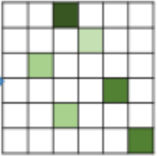

# SCOT ：基于最优传输的语义匹配

## 存在问题：

1. **many to one matching**

    many pixels in a source image are assigned to one target pixel 

    > 多对一的匹配情况

2. **background matching**

    some object pixels are assigned to the background pixel

    > 前景目标匹配到背景像素中

## 主要工作：

对CNN输出的feature map分别求内积矩阵和分类激活层（CAM），

使用最优传输迭代得到最终匹配矩阵。

## Related work

- Sematic correspondence
  
    - early hand-crafted descriptors: SIFT, HOG (geometric models)
    - CNN: using binary foreground mask, beam search algorithm
        - other:  two-stage regression
    
- Class astivation map**(CAM)**

    > 类激活映射

    - implement: 

        - compute a weighted sum of the feature maps of the last convolutional layer
        - select the class-specific feature maps of the last convolutional layer

## 前人工作

最优传输理论（OT）：

$$
\pi^* = argmin_\pi \in \Pi(\mu_s, \mu_t) \int\limits_{\textbf X \times Y} c(x,y)\pi(x,y)dxdy
$$

OT问题目标函数：

$T$ is the transport matrix
$$
T^*=arg min \sum_{ij} T_{ij}, M_{ij} \\
s.t. T1_{n_t} = \mu _s\\
T^T 1_{n_s} = \mu_t
$$

## 整体框架

​    

​          

主要流程理解：

输入：两张图片

pretrained CNN 提取CAM，并从其中提取feature map（大小如何确定？，resize？downsample？）

feature 之间计算相似性（两两像素之间计算），使用归一化内积得到C矩阵如图所示：
$$
C = \frac{f_s \cdot f_t^T }{||f_s||\cdot||f_t||} \in R^{h_s \times w_s \times h_t \times h_s}
$$

OT问题变为求最大值
$$
T^* = argmax_{T \in R^{h_sw_s \times h_tw_t}} \sum_{ij} T_{ij} C_{ij}
$$
注意到$C_{ij} \le 1$ ，此时令$M = 1-C$

可得到标准型的OT问题表示：
$$
T^* = argmin_{T \in R_+^{h_sw_s \times h_tw_t}} \sum_{ij} T_{ij} M_{ij}\\
s.t. T{\bf 1}_{h_tw_t} = \mu_s \\
T1_{h_sw_s} = \mu_t
$$

作者的观点：

If we do not have any prior knowledge, then $\mu_s$ and $\mu_t$ can be set to **uniform disreibutions**, indicating same importance of each point in source and target maps.

SCOT比前人工作（semantic alignment）要好: 

[18] Attentive semanic alignment with offset-aware correlation kernels. ECCV18

[33] End-to-end weakly-suervised semantic aloignment CVPR18

## 实现细节

CAM是

# 对存在问题的解决方法

1. 一对多问题

    使用OT模型解决问题，令两张图像每个像素之间都只能有一个配对

    

2. 前景错误匹配上背景问题

    使用CAM进行msk，区分前后景

## 对工作的理解

根据最优传输理论，目的是匹配两组特征点$X = \{s_i\}^{n_s}_{i=1},X\in R^{f \times n_s}$和$ Y = \{y_j\}^{n_t}_{j=1}, Y\in R^{f \times n_t}$， 它们对应的分布是$\mu_s = \sum\limits ^{n_s} _ {i=1} p^s_i \delta(x_i)，\mu_t = \sum\limits ^{n_st} _ {j=1} p^s_i \delta(y_j)$ ， $\mu_s$ 和$\mu_t$表示的是$X,Y$中元素的重要程度。损失矩阵cost matrix 表示从$x_i$到$y_j$匹配需要的代价，在匹配问题中对应的是特征向量之间的距离。

## 论文带来的思考

文章中使用预训练的CNN提取feature maps和CAM，将所有像素两两计算相似度得到匹配矩阵$M$，利用CAM改变$M$的元素的权重，再使用sinkhorn迭代得到匹配结果。

全文并没有使用深度学习，而仅仅用了预训练的网络特区特征。

## 可以用的idea

使用CAM对像素加上权重，可以令sinkhorn迭代更加关注于前景目标，限制公式如下所示：
$$
T^*=arg min \sum_{ij} T_{ij}, M_{ij} \\
s.t. T1_{n_t} = \mu _s\\
T^T 1_{n_s} = \mu_t
$$

对比于SuperGlue或者前人的工作，约束公式如下：
$$
T^*=arg min \sum_{ij} T_{ij}, M_{ij} \\
s.t. T1_{n_t} = b\\
T^T 1_{n_s} = a
$$
其中的矩阵

可视化的图像对比如图所示：

### Sinkhorn algorithm 流程（得到归一化的匹配矩阵)

---

**input**: $\mu_s,\mu_t, {\bf M}, \epsilon, t_{max}$

**Initialize** : ${\bf K} = e^{-M/\epsilon }, b\gets 1, t\gets 0$

**while** $t \le t_{max}$ and not converge **do**

​	${\bf a} = \mu_s / ({\bf Kb})$

​	${\bf b} = \mu_t / ({\bf K^\top a})$

**end while**

Output: $T=diag({\bf a}){\bf K}diag({\bf b})$

**while** $t \le t_{max}$ and not converge **do**

​	${\bf K} = {\bf K} / ({\bf K 1})$

​	${\bf K} = {\bf K} / ({\bf K^{\top} 1})$

**end while**

---

## 实验验证

### 假设

正确匹配的点集存在相同的分布关系,

相同分布权重的点是否能约大的转移

