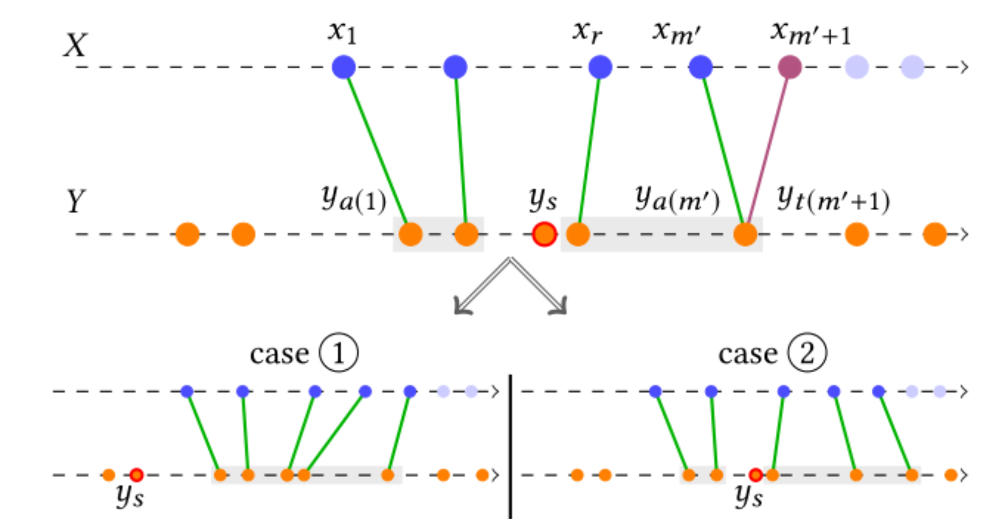

# SPOT 切片局部分配最有传输

匹配问题定义：

如图所示，对于两个一维的对象（数组，可以是特征点集，也可以是质量），要找到一一对应的匹配。将$X$集合中的点在$Y$中找到最符合的点，匹配顺序从左到右，当匹配出现冲突时（如上图的$x_{m'+1}$和$x_{m'}$都匹配到了$y_{t(m'+1)}$中，会出现两种选择方案：

1. 将所有已经匹配的连线往左移动
2. 保留所有已匹配的连线不改动

## 主要思想：

以最小距离总和为目的，

当匹配出现冲突时，分为两种状况：移动以往的分配策略，重新更改最新的分配策略。通过比较两种分配策略的效果决定要使用哪一种。

## 