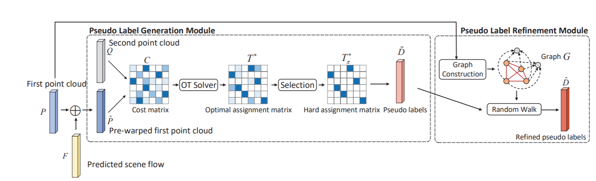
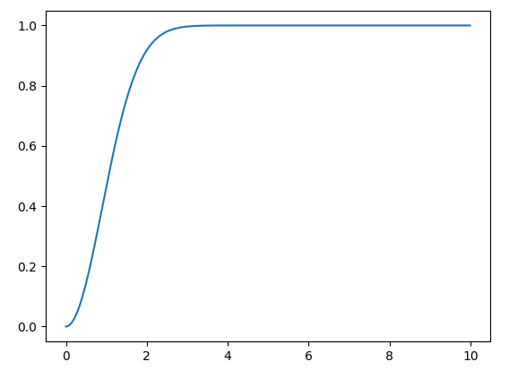
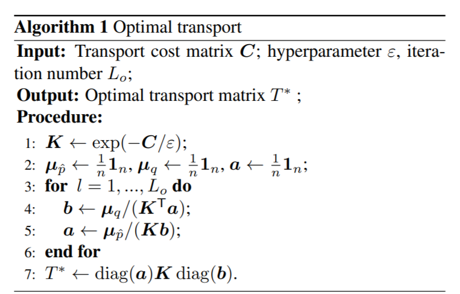
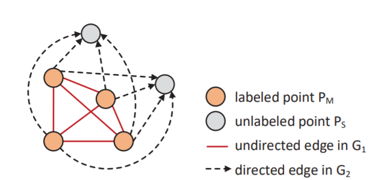

#  Self-Point-Flow: Self-Supervised Scene Flow Estimation from Point Clouds with Optimal Transport and Random Walk

## 任务描述

三维点云的匹配问题,该任务输入为视频两帧之间的3D点云$P, Q \in R^{n \times3}$,利用网络估计出点云流$F$.

## 解决问题

前人的工作使用自监督的方法,生成伪标签的方式生成目标点云$Q$和$P$的匹配关系，从而监督网络进行学习。

主要有两个问题：

1. 点云的颜色和==表面归一化==信息没有用于匹配中，导致信息量不足影响匹配精度
2. 多个点会匹配到一个点上，导致生成的伪标签和真实标签差异大

## 使用方法

1. **对于没有用上点云的其他信息的问题**

在求$P和Q$相似度的时候，将其他信息加入考虑

1. **对于不满足一一匹配的情况**

## 算法流程

1. 首先对于输入的点云$P$加上预测的点云流$F$，使其变换后的$\hat P$更加接近$Q$，从而加快匹配进程。

$$
\hat P = P+F
$$

$F$如何获得？是用网络对生成的$\hat D$进行学习得到的，而设计的算法就是用于生成$\hat D$。

2. 对位移后的点云$\hat P$与$Q$进行匹配，求解问题匹配矩阵
    $$
    \min_T \sum_{ij} C(\hat P,Q)_{ij} T_{ij}
    $$
    首先定义两个点云之间的成本函数$C_{ij} = d(P_{ij} + Q_{ij})$，其中由三个部分组成：

    $C^d$：几何成本
    $C^c$：颜色成本
    $C^s$：表面归一化成本
    $$
    C = C^d + C^c + C^s\\
    $$

- 几何成本计算，使用高斯函数，距离越大，成本越大，公式如下：

$$
C_{ij}^d = 1 - \exp(-\frac{||\hat p_i - q_j||^2}{2\theta_d^2})
$$
 

- 颜色距离计算,高斯函数，颜色差异越大，成本越大：

$$
C_{ij}^c = 1 - \exp(-\frac{||\hat k^c_{p,i} - k^c_{q,j}||^2}{2\theta_c^2})
$$

- 表面归一化计算,同上

利用最优传输（sinkhorn）迭代$C$得到$T^*$，再对每一行求最大值得到$T^*_\pi$

求解最优化问题如下：
$$
T^* = \arg\min_{T\in R^{n \times n}} \sum_{ij} C_{ij}T_{ij} + \varepsilon T_{ij} (\log T_{ij} -1)\\
s.t. T1_n = \mu_{\hat p}, T^\top1_n = \mu_{q}
$$
这里使用熵规范化的算法如下：

最终得到软匹配，通过令==每一行==最大值为1，其余为0得到硬匹配$T^*_\pi \in \{0,1\}$。这里使用每一行的最大值（而不是每一列）的最大值，是为了保证每一个$P_i$都能匹配到对应的$Q$，保证了单射的条件。

将匹配用于$P,Q$得到伪标签点云流$\tilde D \in R^{n \times 3}$,表示每一个点$P_i$ 移动到匹配的$Q$的位移矢量:
$$
\tilde D = T_\pi ^* Q - P
$$

3.用随机游走的方式迭代$\tilde D$，得到最终输出的$\hat D$

- 首先通过判断位移长度将$\tilde D$分为可行位移$\tilde D_M$和不可信位移$\tilde D_S$。将矢量长度大于3.5m的点云流视为不可信位移，其对应的点为无标签点$P_S$,可行位移对应的点为已标签点$P_M$。

- 构建图模型

    在已标签点$P_M$之间构建全连接无向图，而所有的无标签$P_S$被所有$P_M$单向指向。

    

边权重$A$由归一化的距离高斯函数确定：
$$
W_{ij} = \exp(-\frac{||p_i-p_j||^2}{2\theta^2_r})\\
A_{ij}= \frac{W_{ij}}{\sum_{j \neq i}W_{ij}}
$$

> 这里$j\neq i$的定义不是很明白，估计是全图的归一化？

得到边的权重后进行随机游走：对于无边图来说，迭代随机游走直到收敛，并且保留部分初值$\tilde D^{(0)}$，最周收敛得到$\hat D_M$：
$$
\tilde D^{(t)}_M = \alpha AD^{(t-1)}_M+(1-\alpha)\tilde D ^{(0)}_M \\
\hat D_M \approx \tilde D_M^{(\infin)}
$$
这里的操作相当于把每一个节点的位移与领域节点的位移进行加权平均求和。

而对于有向图，只进行一次游走，即将所有的已标签节点的位移$\hat D_M$加权到未标签位移$\hat D_S$中：
$$
\hat D_S = A\hat D_M
$$

4. 最终得到伪标签$\hat D$作为网络训练的监督信息。

    选择合适的网络最终输出预测点云流$F$，和伪监督信息$\hat D$进行L2范数损失。
    $$
    Loss = ||\hat D, F||_2
    $$
    

## 创新点

1. 使用了最有传输和随机游走生成伪标签，保证了一一匹配的结果。

2. 利用网络预测的点云流$F$先对$P$进行位移操作，加快算法的收敛。

3. 在计算相似度时考虑上点云的颜色和表面归一化。

## 启发

利用自监督做图语义匹配