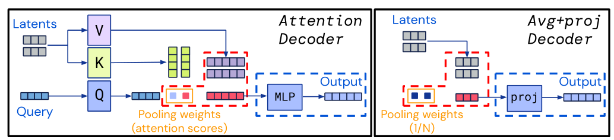

## 会议记录

日期：2021.01.08
报告人：李号元
记录人：李号元
分享论文：PerceiverIO: A General Architecture for Structured Inputs & Outputs
问题：

1. （第9页）：MxC做注意力的通道数量是固定的吗？论文是如何实现他所说的任意输入通道维度的？
   答：输入特征的C通道通过MLP变换到和Latent特征相同的D通道，训练好的模型是有确定的C，数据通过前处理将不同通道的数据补全到C通道。

   会议后查看代码：针对任意维度的输入，在inference阶段，根据输入数据维度生成对应的1x1卷积（线性映射），其中的卷积的参数是随机生成的，即cross-attention部分的可学习参数是没有经过训练的。代码如下，这段代码表示根据输入数据**创建**对应的卷积层，再将数据**输入**到卷积层中得到输出。

   ```python
   q = conv_1d(qk_channels, init_scale=self._init_scale)(inputs_q)
   k = conv_1d(qk_channels, init_scale=self._init_scale)(inputs_kv)
   v = conv_1d(v_channels, init_scale=self._init_scale)(inputs_kv)
   ```


2. （第13页）：PerceiverIO相对Perceiver的改进是什么？

   答：perceiverIO在输出部分用基于cross-attention的decoder代替了perceiver的average操作。


3. （ 第13页）任意输入数据变化到给定的C通道的操作是由前处理主要完成的，为何作者不详细介绍模型的前处理？

   答：文章的重心是为每个domain使用通用的基础模型，可以通过使用基本相同的超参来将模型调整到一个新的domain，而不是为每个domain选择不同的模型，或者给完全不同的模型调整不同的超参。对每一个模态的数据做前处理固然很繁琐，但是文章不认为这是他工作的重点，重点而是放在提出一个通用的框架。
   
   会议后回答：网络输入数据的维度实际上是可以变化的，MLP的输入输出维度并不是在训练过程中定死的，而是在根据每一个输入重新生成一个新的MLP。（具体可查看第一条的回答），前处理更多是为了将不同模态纳入到相同通道维数的MxC特征中。


4. （第13页）模型的Transformer阶段是堆叠多个transformer吗？

   答： 在模型中是只有一个transformer，通过for循环迭代同一个transformer更新特征，其中transformer内包含多个attention模块。以下为perceiverIO的forward代码段：

   ```python
   def __call__(self, inputs, z):
    z = self.cross_attend(z, inputs, is_training=is_training,attention_mask=attention_mask)
    for _ in range(self._num_blocks):
      for self_attend in self.self_attends:
        z = self_attend(z, is_training=is_training)
    return z
   ```


5. （第17页）perceiver和perceiverIO都用于图像分类任务中，为何perceiverIO的效果更好。

   答：作者在论文中展示了perceiverIO的decoder模块和perceiver的平均模块，两者都可以看作是用不同的注意力分数加成到特征中，由下图所示，decoder的注意力权重是可变的，根据相似度来计算的；而perceiver的平均模块可以认为其注意力权重是1/N的均值，因此decoder使用更多的计算量来实现更高的精度。
   
   以下是作者在review中对该问题的解答
   
   > We believe this is because the attentional decoder is more expressive than a standard average + project decoder. This expressivity gain comes for two reasons. First, the attentional decoder learns to weight the contribution of each latent to the output in a data-dependent manner before averaging them, unlike the average + project decoder, which weights the contribution of all latent equally. Second, the attentional decoder includes an MLP after the pooling step (as is standard for attention modules), while typical average + project decoders use a linear layer after pooling. 


6. （第13页）Perceiver中使用了循环插入encoder的操作，而PerceiverIO只用了一次encoder，为何只用一次encoder的效果比循环多次encoder的效果要好？

   答：作者在perceiver中认为latent transformer作为模型的bottleneck可能会由于计算量小而降低效果，因此每一次迭代用更昂贵的encoder（cross-attention）去弥补。而perceiverIO中为何只用一次encoder没有在文章中找到解释。个人理解是，可能在做实验中发现只用一次encoder就能有相对不错的效果，没有必要再增加计算encoder来耗费更多算力。

   以下为perceiver文章中的引用：

   > The size of the latent array allows us to directly model pixels and to build deeper Transformers, but the severity of the bottleneck may restrict the network’s ability to capture all of the necessary details from the input signal.  To hedge against this effect, the Perceiver may be structured with multiple cross-attend layers, which allow the latent array to iteratively extract information from the input image as it is needed. This allows us to tune the model to balance expensive, but informative cross-attends against cheaper, but potentially redundant latent self-attends. 


**关于无人机的使用：**
无人机起飞前一定要进行校检，在每一次更换了起飞地点后要重新做一遍校检。

在飞无人机的时候必须要保证无人机在视野内，不能超出视野飞行。

如果信号不好或者GPS出错导致无人机失控的情况，首先用摄像头斜下45度旋转一周观察无人机周围环境，再将其向操控者位置往回拉。


